

    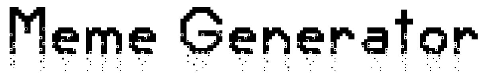

## Table of Contents

* [Introduction](#introduction)
* [Image Generation](#image-generation)
  * [GANs](#gans)
* [Text Generation](#text-generation)
  * [GPT-2](#gpt-2)
* [Meme Generation](#meme-generation)
  * [Setup](#setup)
  * [Modules](#modules)
  * [Main Page](#main-page)
  * [Creator Page](#creator-page)
* [Next Steps](#next-steps)

# Introduction

Using a Flask app, this meme generator will generate pet related memes that have an image of a pet, a quote written on the image, and an associated quote author. There are two types of pets supported - cats and dogs. There are two main modes to generate memes with this project, as well as sub-modes, as described below.

__Local generation__
- User will get a randomized image and quote/author for a specified animal type. 

- The user can also provide their own quote and author which will be used on a randomized image.

__Flask GUI generation__
- User will get a randomized image and quote/author for a specified animal type.

- User can provide an image link, as well as their own quote and author, and a meme will be generated using those parameters.

# Image Generation

Instead of using real animal images, a machine learning model was used to generate dog and cat images to use as memes. The model used to generate the animal images is BigGAN, which is a version of a Generative Adversarial Network (GAN). A GAN is a neural network trained on real images. Training a GAN takes a lot of training data, and to get good results, it can take a long time unless the model is trained on a high end system (specifically the graphics card, or GPU). Luckily there are pre-trained models which can be used to generate images.

## GANs

A GAN has two neural networks under the hood. There is a generator, and a discriminator. A simple description of how a GAN works: The generator will take an input image which is randomized noise, attempt to generate an image that looks like the training data, and pass it to the discriminator. The discriminator will classify the generated image and output a probability how how likely the generated image is a real image.

    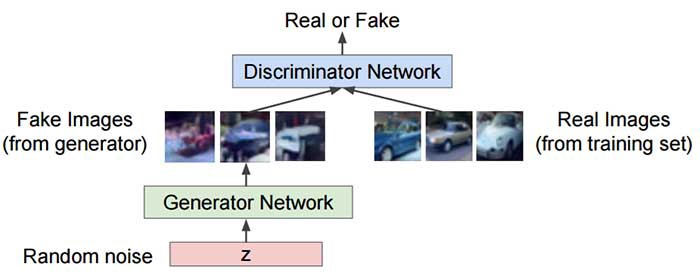
    
Image source: https://medium.com/analytics-vidhya/gans-a-brief-introduction-to-generative-adversacarial-networks-f06216c7200e.

>"We can think of the generator as being like a counterfeiter, trying to make fake money, and the discriminator as being like police, trying to allow legitimate money and catch counterfeit money.  
To succeed in this game, the counterfeiter must learn to make money that is indistinguishable from genuine money, and the generator network must learn to create samples that are drawn from the same distribution as the training data."  
-NIPS 2016 Tutorial: Generative Adversarial Networks, 2016

The images used for this project were created with a higher diversity in the generation, which has a tradeoff of looking a bit...weird. This can be entertaining, and a handful of dog and cat images were used from this model. When generating dog images, they often times came out good, as shown in the left example below. Some images were not believable, with strange artifacts like longer ears, shown in the right example below.

    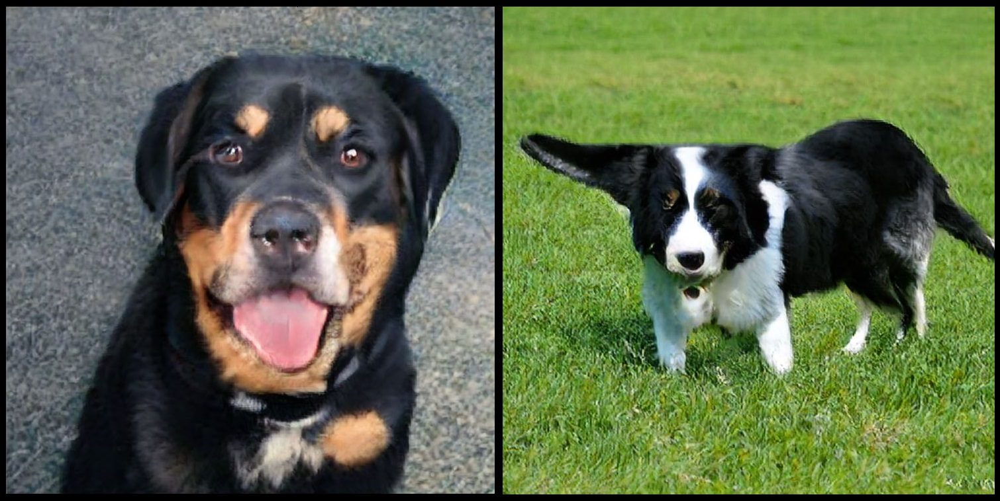
    
GAN generated dogs.

Cats were less "normal" looking and often looked strange. Two examples are given below.

    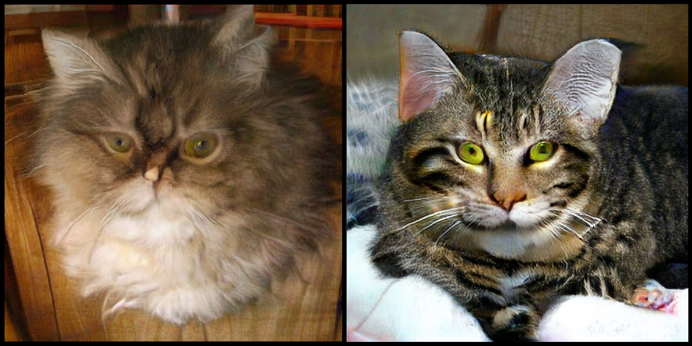
    
GAN generated cats.

The code to generate the images is provided, but requires a specific version of Tensorflow to be installed. Within the script has a link to the Tensorflow project code that can be ran via Google colab, which provides an online environment that anyone can use to generate GAN images. The categories are not limited to dogs and cats. For instance, here are some generated images of magpies and wine bottles.

    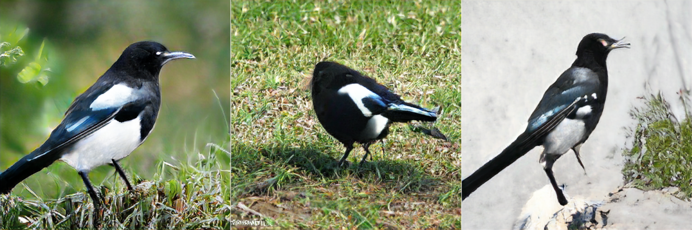
    
GAN generated magpies.

    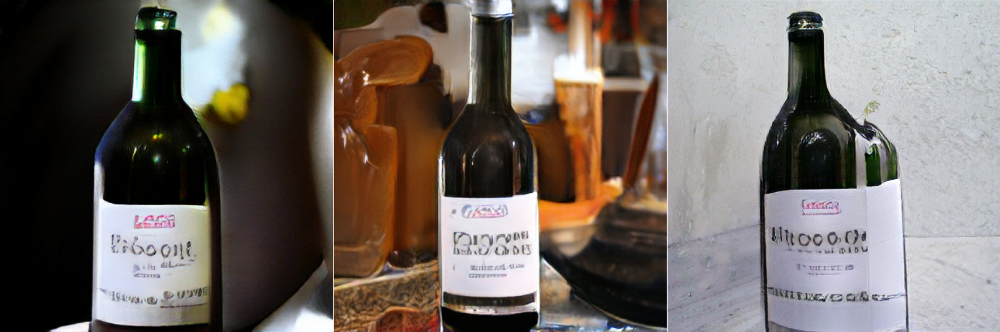
    
GAN generated wine bottles.

# Text Generation

Memes for this project were generated using a machine learning model called GPT-2, developed by OpenAI. These were generated locally on my desktop machine, and had to be hand filtered for reasons described below. Half the memes in this project are generated using machine learning, but to round it out I included another equal number of quotes picked from web pages providing social media captions for dog and cat pictures. 

## GPT-2

GPT-2 is a transformer model which was pre-trained on over 8 million webpages, as well as a large number of books to create a generalized language model capable being fine-tuned to generate text. A good visual explanation of the model can be found here:

https://jalammar.github.io/illustrated-gpt2/

The basic transformer model uses an attention mechanism, and has a general structure shown below.

    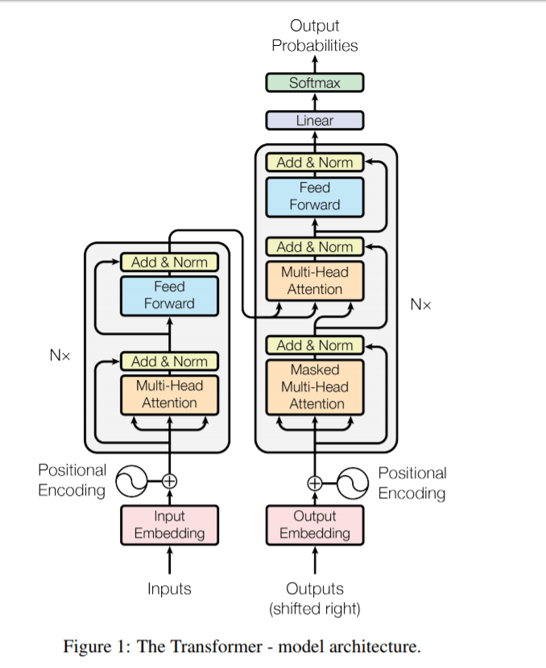
    
Image source: https://towardsdatascience.com/examining-the-transformer-architecture-part-1-the-openai-gpt-2-controversy-feceda4363bb.

For this project, the model was fine-tuned (another training step) on selected memes from https://github.com/schesa/ImgFlip575K_Dataset. I specifically wanted to find memes that had animals in the text, but since that was not very plentiful, I replaced several keywords with dog/cat related words. Words like "boy", "human", "woman" were replaced with "cat", "dog", "cat". The model was re-trained on a GTX 1080ti graphics card for around 10 hours. Memes generated from this model were often littered with sexist or racist language. This is because the training data are memes scraped from the internet, and they often have hateful language. I had attempted to filter out some of these kinds of memes from the training data, but for this project I selected a subset of memes that sounded like what dogs or cats would say, so the memes used do not contain any untasteful language.

# Meme Generation

Memes are generated using a Flask app. The app.py script can be launched in the terminal, and a local URL will be generated which can be opened in a browser.

## Setup

To run this project, make sure all packages in the `requirements.txt` file are installed to the specified versions. This was generated from a virtual environment running Python 3.9 using the `pip freeze > requirements.txt` command. A more simplified requirements text is also provided as `_requirements.txt`. Note: tensorflow packages and scipy are only needed to run the GAN script (pet_gan.py).

## Modules

The project uses several modules to create memes and display them via Flask. These modules are:

- app - The script that runs the Flask app and creates the user interface for generating memes.
- meme - The script that can be used outside the Flask app to generate random memes, or user specified memes on random dog/cat images. The user can add their own text and author, or chose from normal and machine learning generated memes.
- QuoteModel/quote_model - Creates `QuoteModel` objects which have a body and author from ingested quotes that are of filetypes txt, pdf, docx, and csv.
- MemeEngine/meme_engine - From an image path, creates an image object, resized to a specified width while maintaining the aspect ratio, and adds text onto the image, saving it to a file location.

## Main Page

The main interface of the app looks like:

    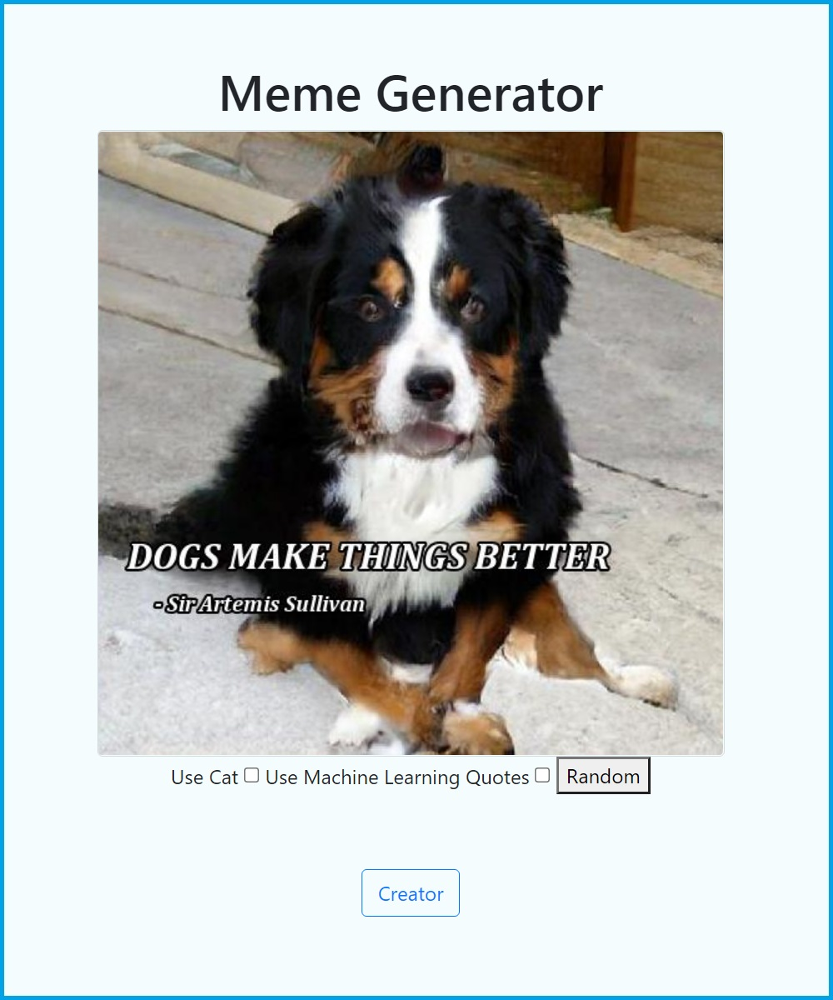
    
Meme Generator app main page.

The features on the main page include two checkboxes, a `Random` button, and a `Creator` button. By clicking on the `Random` button, a meme will be generated using a random quote/author placed on a random image. The default animal type will be dog, but the user can check the "Use Cat" checkbox to generate a meme using a cat and then hit the `Random` button to create a cat meme.

    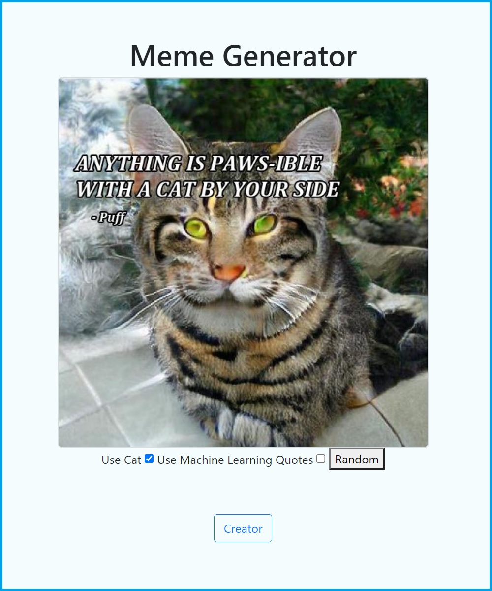
    
Meme Generator app using a cat image.

The default quote type will be "normal", which are quotes picked off the internet by a human (the one typing out this README file). To generate a meme using machine learning generated quotes, simply check the associated checkbox and hit the `Random` button.

    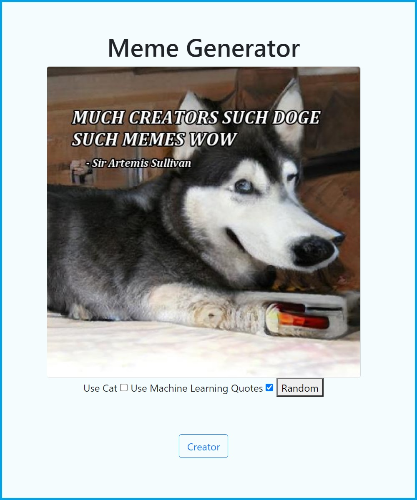
    
Meme Generator app using a machine learning quote.

And of course the user may select both checkboxes to generate a cat meme with a machine learning generated quote.

    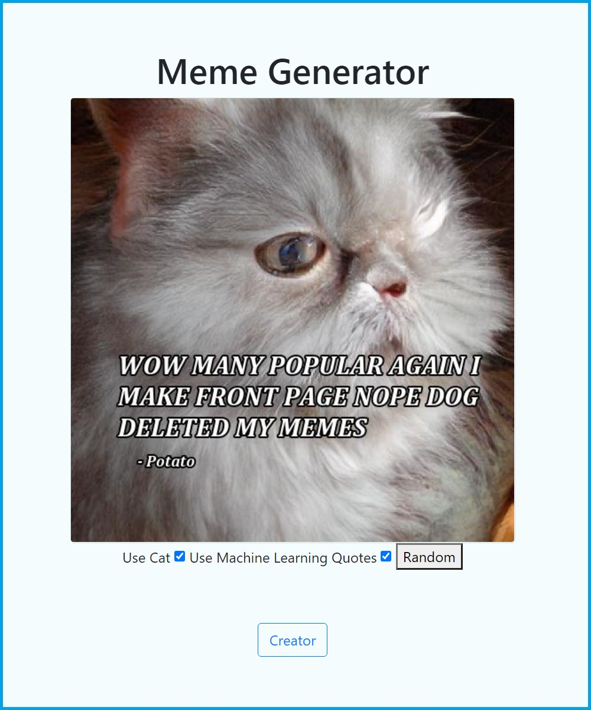
    
Meme Generator app using a cat image with a machine learning quote.

## Creator Page

By clicking on the "Creator" button, the user will be taken to a page that allows them to pick an image off the internet and add their own text and author. The position of the text will still be randomized.

    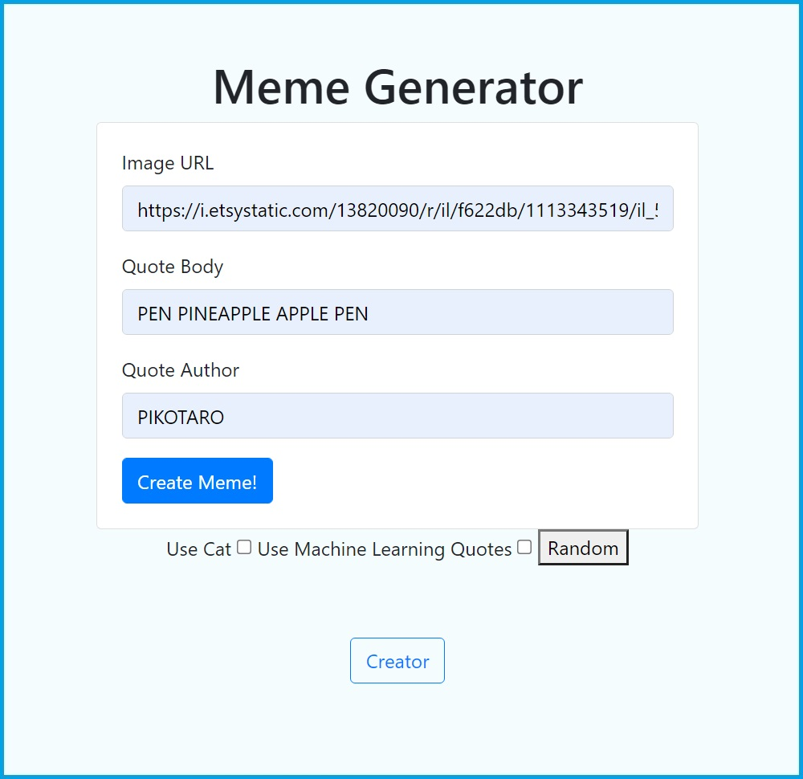
    
Creator page.

And the resulting meme will be generated.

    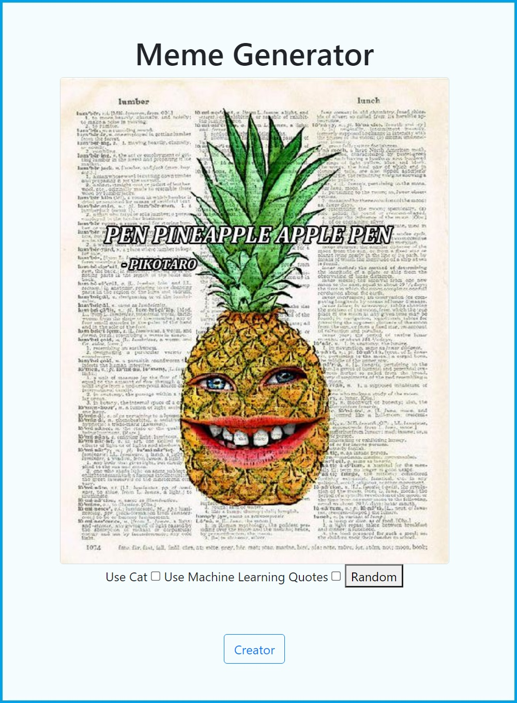
    
Pen Pineapple Apple Pen.

# Next Steps

The next steps would be to add more image types for random meme generation, and host the flask app on a server. The position of the text on the image should be weighted so it appears at the top or bottom of the image most of the time, to prevent it from covering the face of the animal. Ideally having the text generator model be able to create live samples would be interesting, but due to the problematic nature of the meme training data, having generated text that a human does not check could be a bad idea.